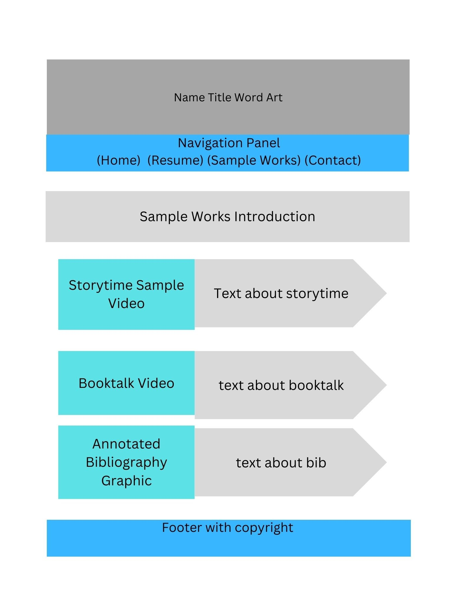

# Nicholle Ruhlman's INF6420 Portfolio Project

A professional portfolio website showcasing my work.

<h1>Wireframes</h1>

<h2>Wireframe of Home Page</h2>

<b>Header</b> - Contains name (Nicholle Ruhlman), Title (Professional Portfolio), and clipart design (TBD). Consistent across all pages.  

<b>Navigation Menu</b> - Includes links to other webpages (Home, Resume, Sample Works, Contact). Consistent across all pages

<b>Main Content</b> - will contain welcome message, photo of myself, and an about me section. 

<b>Footer</b> - includes copyright information. Consistent across all pages.

<h2>Wireframe of Resume Page</h2>

<b>Header</b> - Contains name (Nicholle Ruhlman), Title (Professional Portfolio), and clipart design. Consistent across all pages.  

<b>Navigation Menu</b> - Includes links to other webpages (Home, Resume, Sample Works, Contact). Consistent across all pages

<b>Main Content</b> - will contain a paragraph on professional philosopy and a sample resume section covering education and professional experiences

<b>Footer</b> - includes copyright information. Consistent across all pages.

<h2>Wireframe of Sample Works Page</h2>

<b>Header</b> - Contains name (Nicholle Ruhlman), Title (Professional Portfolio), and clipart design. Consistent across all pages.  

<b>Navigation Menu</b> - Includes links to other webpages (Home, Resume, Sample Works, Contact). Consistent across all pages

<b>Main Content</b> - will contain a paragraph on coursework samples and will contain at least 2 videos (storytime and booktalk) and a graphic (annotated bib) 
each with a brief description. 

<b>Footer</b> - includes copyright information. Consistent across all pages.

<h2>Wireframe of Contact Page</h2>

<b>Header</b> - Contains name (Nicholle Ruhlman), Title (Professional Portfolio), and clipart design. Consistent across all pages.  

<b>Navigation Menu</b> - Includes links to other webpages (Home, Resume, Sample Works, Contact). Consistent across all pages

<b>Main Content</b> - will contain contact me message, there will be a field for sender to enter in name, email address, message and then submit.

<b>Footer</b> - includes copyright information. Consistent across all pages.